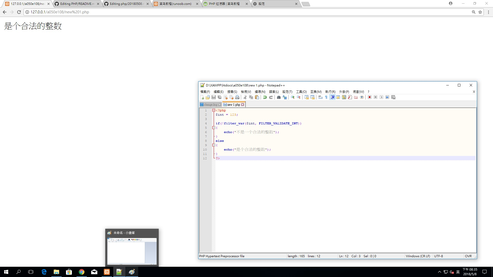
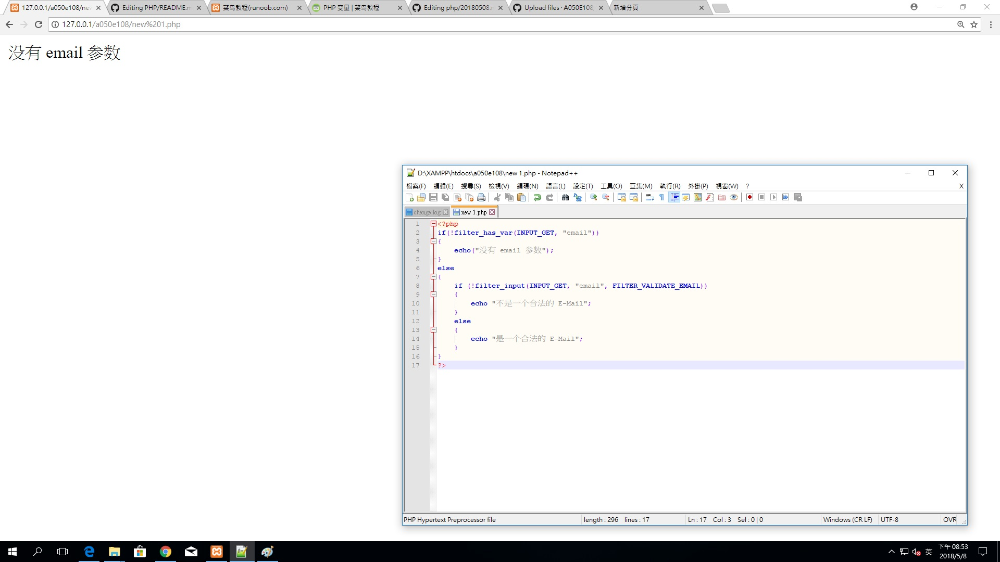
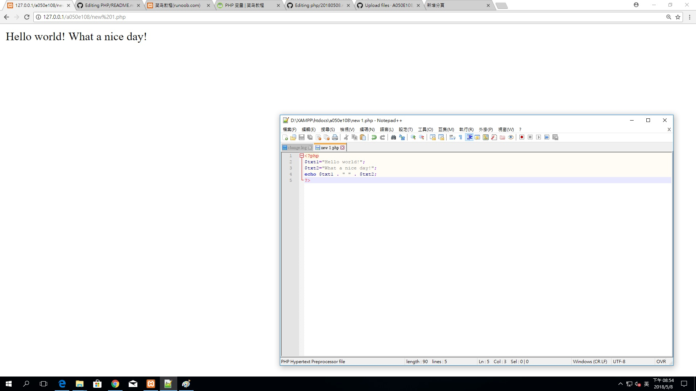
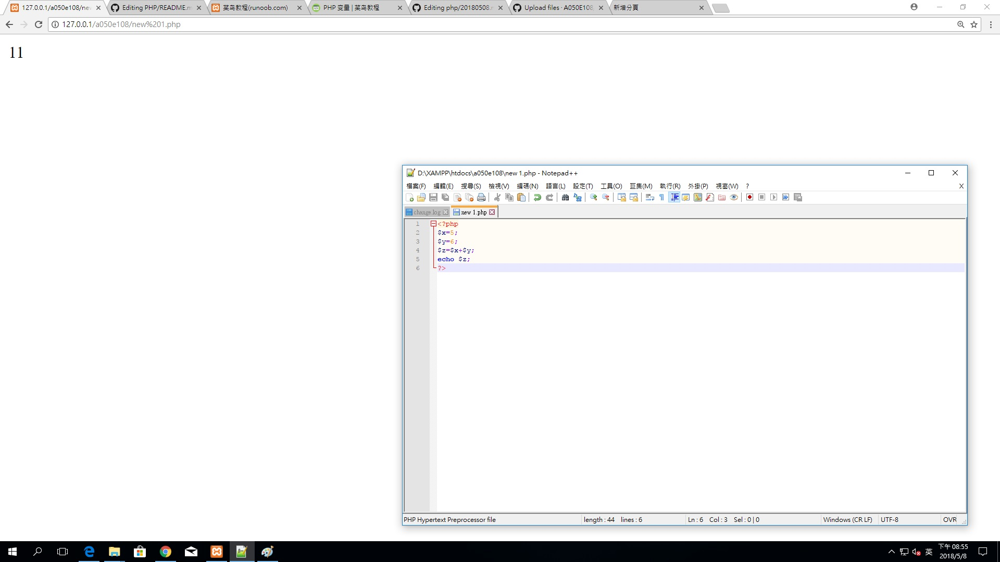

# PHP

教科書:PHP7&MySQL跨裝置網站開發：超威範例集(第二版)

參考書:跨裝置網頁設計：HTML5、CSS3、JavaScript、jQuery、Bootstrap、jQuery Mobile(第三版)

``` 
```
# XAMPP

### 作業ㄧ
```
<?php
$int = 123;
 
if(!filter_var($int, FILTER_VALIDATE_INT))
{
    echo("不是一个合法的整数");
}
else
{
    echo("是个合法的整数");
}
?>

``` 


```
### 作業二
```
<?php
$var=300;
 
$int_options = array(
    "options"=>array
    (
        "min_range"=>0,
        "max_range"=>256
    )
);
 
if(!filter_var($var, FILTER_VALIDATE_INT, $int_options))
{
    echo("不是一个合法的整数");
}
else
{
    echo("是个合法的整数");
}
?>


``` 

```
### 作業三
``` 
<?php
if(!filter_has_var(INPUT_GET, "email"))
{
    echo("没有 email 参数");
}
else
{
    if (!filter_input(INPUT_GET, "email", FILTER_VALIDATE_EMAIL))
    {
        echo "不是一个合法的 E-Mail";
    }
    else
    {
        echo "是一个合法的 E-Mail";
    }
}
?>
```

### 作業四
```
<?php 
$txt1="Hello world!"; 
$txt2="What a nice day!"; 
echo $txt1 . " " . $txt2; 
?>

``` 


### 作業五
```
<?php
$x=5;
$y=6;
$z=$x+$y;
echo $z;
?>
``` 

